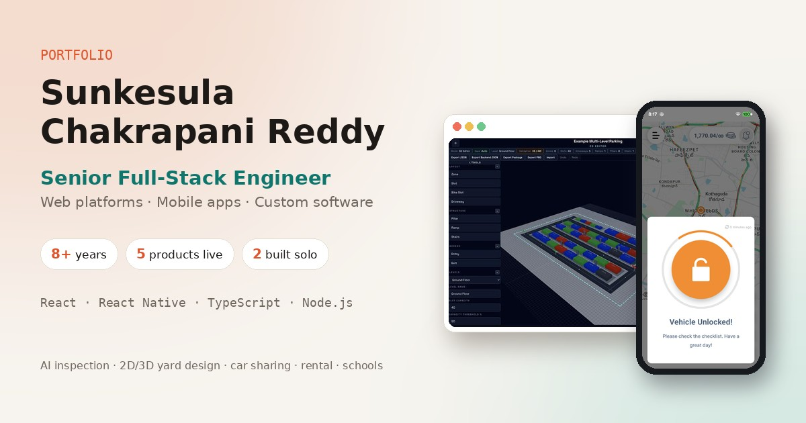

# Sunkesula Chakrapani Reddy — Portfolio

Senior full-stack engineer (React Native · React · TypeScript · Node.js) with 8+ years shipping mobile and web products for clients in India and the Gulf.
This repo is the source of my personal portfolio: the products I've built, the hard problems behind them, and how to reach me.

**Live site:** [chakrapani-reddy.netlify.app](https://chakrapani-reddy.netlify.app/)



## Featured work

| Product | What it is | My role |
|---|---|---|
| **Verifai AI** | AI vehicle inspection & damage detection | Web app — assessments, damage tables, model confidence |
| **Yard Management** | 2D/3D yard design & operations platform | Built solo, end to end |
| **CheckNShare** | Corporate car-sharing (mobile + web portal) | Lead mobile engineer since 2022 — BLE lock/unlock, 3 React Native upgrades |
| **Alfaris Rent-A-Car** | Car rental app & booking website | Modernised a live app, Arabic RTL, subscriptions & payments, RN 0.84 upgrade |
| **CBS Student Pass & Attendance** | School hall-pass & attendance system | Freelance, sole developer — mobile app, web portals, backend |

Each product has its own case study page with screens, demo videos and the challenges solved.
Client source code is private; all screens use demo data.

## Built with

- **React 19 + TypeScript + Vite** — no UI framework, no router library
- Tiny custom router (`src/router.tsx`) with scroll restoration on Back/Forward
- Light (sand) and dark themes, remembered per visitor
- Responsive from phone to wide desktop; respects reduced-motion
- Scroll-reveal animations with `IntersectionObserver`
- Hosted on **Netlify** (SPA redirect in `netlify.toml`)

## Run locally

```bash
npm install
npm run dev        # http://localhost:5173
npm run build      # production build → dist/
npm run preview    # serve the production build
npm run typecheck  # TypeScript check
```

Requires Node.js 18 or newer.

## Project structure

```
src/
  data.ts            ← all content: profile, projects, case studies, journey, stack
  App.tsx            ← routes: "/" and "/projects/:slug"
  router.tsx         ← client-side router
  useReveal.ts       ← scroll-reveal hook
  components/        ← Nav, Hero, PhoneMockup, Projects, Sections, ThemeSwitcher, …
  pages/             ← Home, CaseStudy, NotFound
  styles.css         ← theme colours at the top
public/
  projects/          ← case-study images and videos
  hero/              ← hero screenshots
  Sunkesula_Chakrapani_Reddy.pdf   ← resume (web copy)
  og-image.jpg       ← link-preview image
netlify.toml         ← build settings + SPA redirect
```

## Updating content

- **Text, projects, experience:** edit `src/data.ts`.
- **Media:** add files to `public/projects/` and reference them from the project in `src/data.ts`.
- **Resume:** replace `public/Sunkesula_Chakrapani_Reddy.pdf` (keep the name) and push — Netlify republishes automatically.
- **Colours:** CSS variables at the top of `src/styles.css` (`[data-theme="sand"]` and `[data-theme="dark"]`).

## Deploy

1. Netlify → **Add new site → Import an existing project → GitHub** → select this repo.
2. Build command `npm run build`, publish directory `dist` (already set in `netlify.toml`).
3. Every push to `main` redeploys the site.

## Contact

- Email: [s.chakri15@gmail.com](mailto:s.chakri15@gmail.com)
- LinkedIn: [chakrapani-reddy-977846140](https://www.linkedin.com/in/chakrapani-reddy-977846140)
- GitHub: [ChakrapaniReddy15](https://github.com/ChakrapaniReddy15)

---

© Sunkesula Chakrapani Reddy. Code is shared for reference; project screenshots, videos and the resume may not be reused.
